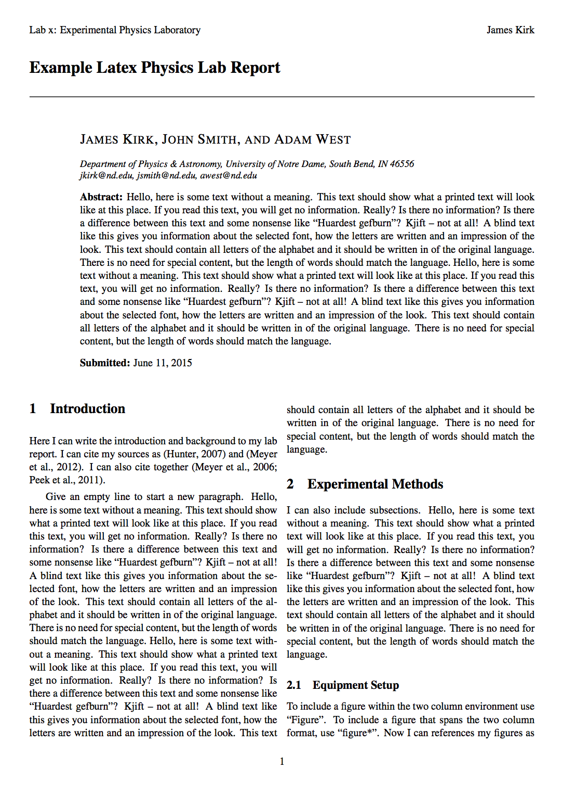

# LabReport

This is an example of a Latex lab report prepared using the LabReport 
class file. Examples of figures/tables throughout. 

To make a new report, alter the *project* variable in the *Makefile* to
change the name of the output PDF file. Alter the *view* variable in the
*Makefile* to change the default PDF viewing application (e.g., *evince*).
In *Source/Main.tex* you can alter the parameters of your class/section etc.
and give the report a title and abstract. 

Rename/alter/add/remove the *input* files to
include whatever sections you like. Put your references in *Source/Main.bib*.

To compile and view your document, issue the `make` command from the 
*LabReport*  directory (i.e., where the *Makefile* is). The first time you 
compile your document, or anytime you add more references, you will need to 
issue `make bib` to run *bibtex*.

##Author

Geoffrey Lentner 
Graduate Research Assistant 
Department of Physics and Astronomy 
University of Louisville 

<a href="http://glentner.github.io">Website</a> | 
<a href="mailto:grlent01@louisville.edu">Email</a>

##Preview

